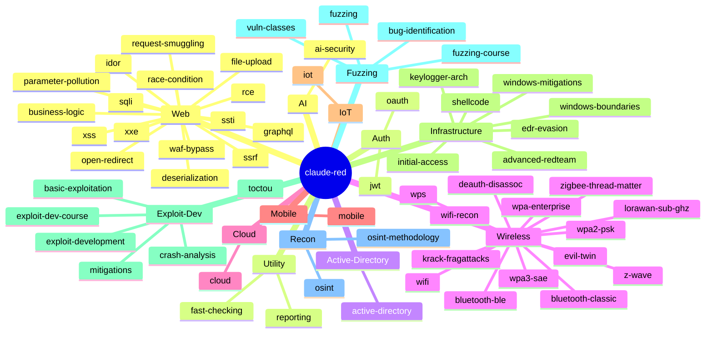

# claude-red — Library Mindmap

A visual map of every skill in the library, by category. Use it to navigate, to discover skills you didn't know existed, and to spot coverage gaps before an engagement.

References for completeness checking: [MITRE ATT&CK](https://attack.mitre.org/), [HackTricks](https://book.hacktricks.xyz/), [OWASP WSTG](https://owasp.org/www-project-web-security-testing-guide/), [PayloadsAllTheThings](https://github.com/swisskyrepo/PayloadsAllTheThings).

---

## Library Map

---

## Coverage Cross-Reference

Use this table to confirm coverage of common offensive surfaces. If a row has no skill, it's a gap.

### Web Application (OWASP WSTG)

| Surface | Skill |
|---|---|
| Information gathering | `recon/offensive-osint`, `recon/offensive-osint-methodology` |
| Configuration / deployment | `web/offensive-waf-bypass` |
| Identity management | `auth/offensive-jwt`, `auth/offensive-oauth` |
| Authentication | _(planned: `web/auth-bypass`)_ |
| Authorization | `web/offensive-idor` |
| Session management | `auth/offensive-jwt`, `auth/offensive-oauth` |
| Input validation | `web/offensive-sqli`, `web/offensive-xss`, `web/offensive-xxe`, `web/offensive-ssti`, `web/offensive-ssrf` |
| Error handling | _(implicit across web skills)_ |
| Cryptography | _(planned)_ |
| Business logic | `web/offensive-business-logic` |
| Client-side | `web/offensive-xss`, `web/offensive-open-redirect` |
| API testing | `web/offensive-graphql` |

### Internal Network / Active Directory (MITRE ATT&CK Enterprise)

| Tactic | Skill |
|---|---|
| Reconnaissance | `recon/offensive-osint`, `active-directory/offensive-active-directory` |
| Initial Access | `infrastructure/offensive-initial-access` |
| Execution | `infrastructure/offensive-advanced-redteam` |
| Persistence | `active-directory/offensive-active-directory` |
| Privilege Escalation | `active-directory/offensive-active-directory` |
| Defense Evasion | `infrastructure/offensive-edr-evasion`, `infrastructure/offensive-windows-mitigations`, `infrastructure/offensive-windows-boundaries` |
| Credential Access | `active-directory/offensive-active-directory` |
| Discovery | `recon/offensive-osint`, `active-directory/offensive-active-directory` |
| Lateral Movement | `active-directory/offensive-active-directory`, `infrastructure/offensive-advanced-redteam` |
| Collection | `infrastructure/offensive-advanced-redteam` |
| Command and Control | `infrastructure/offensive-advanced-redteam` |
| Exfiltration | `infrastructure/offensive-advanced-redteam` |
| Impact | `infrastructure/offensive-advanced-redteam` |

### Wireless

| Surface | Skill |
|---|---|
| Recon / war-driving | `wireless/offensive-wifi-recon` |
| WPA2-PSK | `wireless/offensive-wifi` |
| WPA3-SAE | `wireless/offensive-wifi` |
| WPA-Enterprise | `wireless/offensive-wifi` |
| WPS | `wireless/offensive-wifi` |
| Evil twin / KARMA / Mana | `wireless/offensive-wifi` |
| KRACK / FragAttacks | `wireless/offensive-wifi` |
| Bluetooth (BLE + Classic) | `wireless/offensive-wifi` |
| Zigbee / Thread / Matter | `wireless/offensive-wifi` |
| Z-Wave | `wireless/offensive-wifi` |
| LoRa / sub-GHz | `wireless/offensive-wifi` |

### Cloud

| Provider / Surface | Skill |
|---|---|
| AWS — privesc, IMDS, persistence | `cloud/offensive-cloud` |
| Azure — privesc, IMDS, persistence | `cloud/offensive-cloud` |
| GCP — privesc, IMDS, persistence | `cloud/offensive-cloud` |
| Cross-cloud / OIDC trust | `cloud/offensive-cloud` |
| Hybrid identity (AAD Connect, ADFS) | _(planned: `cloud-identity/`)_ |

### Mobile

| Platform / Surface | Skill |
|---|---|
| Android static + dynamic | `mobile/offensive-mobile` |
| iOS static + dynamic | `mobile/offensive-mobile` |
| Firebase / cloud misconfig | `mobile/offensive-mobile` |
| Mobile API testing | `mobile/offensive-mobile` |
| Biometric / pinning bypass | `mobile/offensive-mobile` |

### IoT / Embedded

| Layer | Skill |
|---|---|
| Hardware recon | `iot/offensive-iot` |
| UART / JTAG / SWD | `iot/offensive-iot` |
| Flash extraction | `iot/offensive-iot` |
| Firmware analysis | `iot/offensive-iot` |
| Bootloader / secure boot | `iot/offensive-iot` |
| RTOS exploitation | `iot/offensive-iot` |
| ICS / OT protocols | `iot/offensive-iot` |
| MQTT / CoAP | `iot/offensive-iot` |

### Exploit Development

| Topic | Skill |
|---|---|
| Beginner / mitigations off | `exploit-dev/offensive-basic-exploitation` |
| Course curriculum | `exploit-dev/offensive-exploit-dev-course` |
| Stack / heap / ROP | `exploit-dev/offensive-exploit-development` |
| Modern mitigations | `exploit-dev/offensive-mitigations` |
| Crash triage | `exploit-dev/offensive-crash-analysis` |
| TOCTOU / race | `exploit-dev/offensive-toctou`, `web/offensive-race-condition` |

### Fuzzing & Vulnerability Research

| Topic | Skill |
|---|---|
| Coverage-guided fuzzing | `fuzzing/offensive-fuzzing` |
| Fuzzing curriculum | `fuzzing/offensive-fuzzing-course` |
| Static review patterns | `fuzzing/offensive-bug-identification` |
| Vuln class taxonomy | `fuzzing/offensive-vuln-classes` |

### AI Security

| Topic | Skill |
|---|---|
| Prompt injection / jailbreak / RAG | `ai/offensive-ai-security` |

### Utility

| Topic | Skill |
|---|---|
| Fast triage checklist | `utility/offensive-fast-checking` |
| Pro pentest reporting | `utility/offensive-reporting` |

---

## How to Use the Mindmap

- **Pre-engagement:** Walk the relevant category branch and confirm a skill exists per surface in scope. Gaps you spot here are gaps in the engagement plan.
- **During engagement:** Click into the category for the surface you're testing; load only those skills into Claude.
- **Post-engagement:** Cross-check findings against the relevant Mindmap branches to ensure no surface was skipped.
